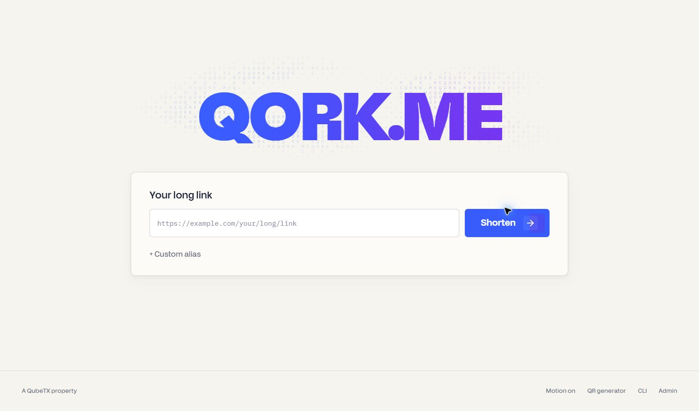
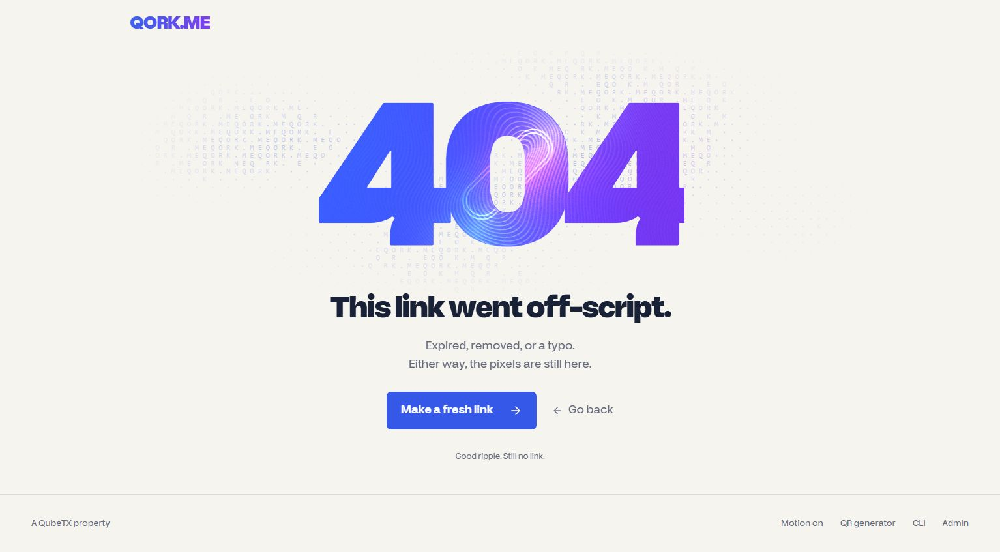

# Dither + Hologram launch verification

## Local checks — September 21, 2026

- Full Vitest suite: 39 files, 222 tests passed, covering shortcode rules, API errors, admin identity, request races, redirect freshness, atomic purge routing, clipboard rejection, cancellation, and keyboard tabs.
- Eight simultaneous requests for one destination returned the same short link; exactly one response reported a new link.
- The local form created `launch-check-20260921`; explicit Copy matched its full HTTPS address. Duplicate aliases and invalid URLs produced inline errors. Two redirects returned the destination with `no-store`.
- A temporary, transaction-scoped table of 250,000 synthetic URLs exercised equivalent indexes: code lookup 0.689ms, newest-25 pagination 1.206ms, and selective substring search 1.337ms execution time. This is a query-plan probe, not a production throughput or load qualification. Synthetic rows were not inserted into production URL tables.
- Real Chrome WebGPU rendering verified on this machine, including pointer lighting and the linked-ring engraving centered in the 404 zero. Desktop and 390px layouts inspected for main form, CLI, and missing links; motion toggle and reduced motion checked.
- CLI release assets checked against GitHub v1.1.1. Copying preserves the full Windows PowerShell wrapper. Arrow-key tab selection and phone command wrapping verified.
- Database migrations applied: indexed search/paging, concurrent URL deduplication, aggregate simplification, private admin functions, and atomic purge. Anonymous execution of private admin functions is denied.
- Local GitHub authentication succeeded. The local environment has no service-role key, so populated admin operations are reserved for the authenticated production smoke test; errors remain visible and retryable.

- A blocked hologram module produced the real `fallback` state while the form still shortened a URL successfully. Network blocking was removed after the check.

## Release checks

Local optimized production build passed on Next.js 15.5.25. Lint, TypeScript, formatting, and npm audit passed (zero reported vulnerabilities). The optimized bundle renders both effects live in Chrome. Main layout was compared at the same 1534×903 viewport as the approved prototype. CI, deployment, final production smoke, and the user-authorized link cleanup are recorded after verification.

## Practical limits

GPU effects are decoration. A readable HTML gradient and static dotted field remain available when rendering fails. Device/browser coverage is Chrome on this Windows machine plus responsive emulation; no claim is made about every GPU or physical mobile device. Database performance depends on traffic, plan capacity, and query selectivity. Indexed probes and request timeouts do not establish unlimited capacity.
